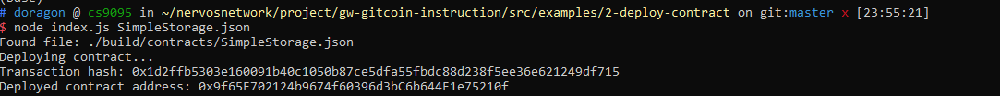

Gitcoin: 2) Deploy A Simple Ethereum Smart Contract On Polyjuice

1. A screenshot of the console output immediately after you have successfully deployed a smart contract.


2. The transaction hash from the contract deployment (in text format).

```
0x1d2ffb5303e160091b40c1050b87ce5dfa55fbdc88d238f5ee36e621249df715 
```

3. The deployed contract address from the contract deployment (in text format).

```
0x9f65E702124b9674f60396d3bC6b644F1e75210f
```

