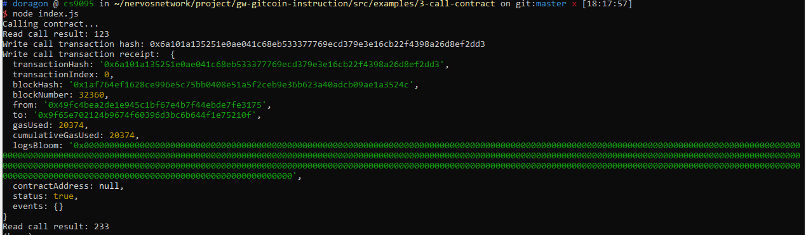

Gitcoin: 3) Issue A Smart Contract Call To The Deployed Smart Contract


1. A screenshot of the console output immediately after you have successfully issued a smart contract call.


2. The `transaction hash` from the console output (in text format).

```
0x6a101a135251e0ae041c68eb533377769ecd379e3e16cb22f4398a26d8ef2dd3
```

3. The `contract address` that you called (in text format).

```
0x9f65E702124b9674f60396d3bC6b644F1e75210f
```

4. The `ABI` for contract you made a call on (in text format).

```
[
    {
      "inputs": [],
      "stateMutability": "payable",
      "type": "constructor"
    },
    {
      "inputs": [
        {
          "internalType": "uint256",
          "name": "x",
          "type": "uint256"
        }
      ],
      "name": "set",
      "outputs": [],
      "stateMutability": "payable",
      "type": "function"
    },
    {
      "inputs": [],
      "name": "get",
      "outputs": [
        {
          "internalType": "uint256",
          "name": "",
          "type": "uint256"
        }
      ],
      "stateMutability": "view",
      "type": "function"
    }
  ]
```