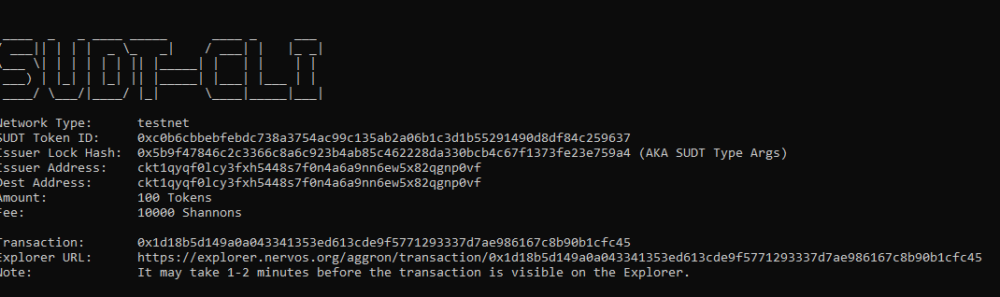
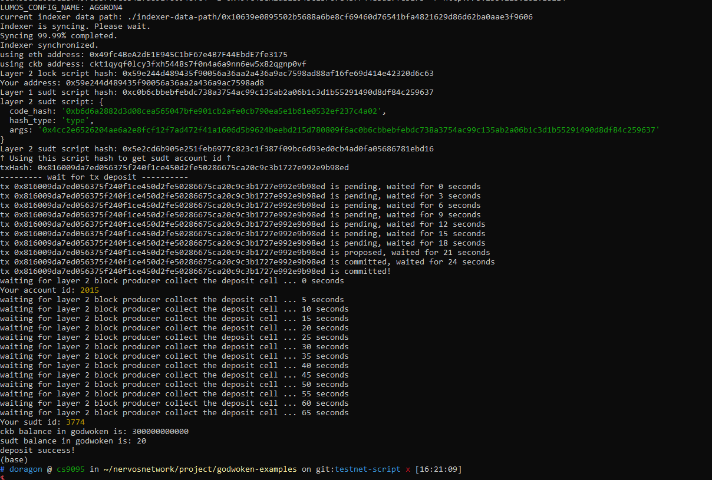

Gitcoin: 4) Issue An SUDT Token On Layer 1 And Deposit It To Layer 2


1. A link to the Layer 1 address you funded on the Testnet Explorer.

[ckt1qyqf0lcy3fxh5448s7f0n4a6a9nn6ew5x82qgnp0vf](https://explorer.nervos.org/aggron/address/ckt1qyqf0lcy3fxh5448s7f0n4a6a9nn6ew5x82qgnp0vf)

2. A screenshot of the console output immediately after using sudt-cli to create your SUDT tokens on Layer 1.



3. A link to the transaction ID created by `sudt-cli` on the Testnet Explorer.

[1d18b5d149a0a043341353ed613cde9f5771293337d7ae986167c8b90b1cfc45](https://explorer.nervos.org/aggron/transaction/0x1d18b5d149a0a043341353ed613cde9f5771293337d7ae986167c8b90b1cfc45)

4. A screenshot of the console output immediately after you have successfully submitted a deposit to Layer 2 using the `account-cli` tool.



5. The SUDT ID from the console output after executing the deposit script (in text format).

```
3774
```