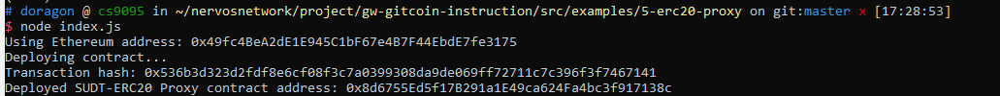
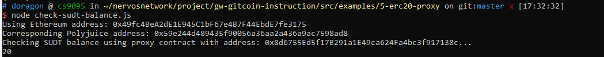
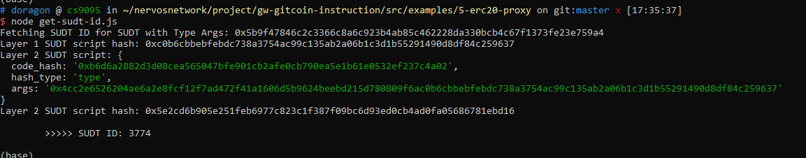

Gitcoin: 5) Deploy The ERC20 Proxy Contract For The Deposited SUDT

1. A screenshot of the console output immediately after deploying smart contract.



2. The address of the ERC20 Proxy Contract you deployed (in text format).

```
0x8d6755Ed5f17B291a1E49ca624Fa4bc3f917138c 
```

3. A screenshot of the console output immediately after checking your SUDT balance.



4. The Ethereum address that was checked (in text format).

```
0x49fc4BeA2dE1E945C1bF67e4B7F44EbdE7fe3175
```

Bonus: Get Layer 2 SUDT ID from Layer 1 SUDT Issuer Lock Hash (AKA SUDT Type Args)

