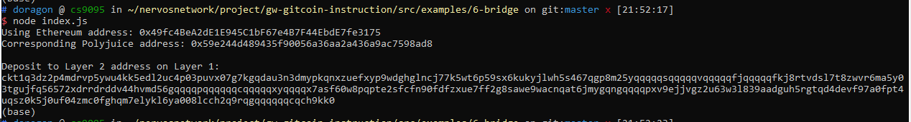

Gitcoin: 6) Use Force Bridge To Deposit Tokens From Ethereum To Polyjuice


1. A screenshot of the console output immediately after you have successfully generated your Deposit Receiver Address.



2. Your Deposit Receiver Address (in text format).

```
ckt1q3dz2p4mdrvp5ywu4kk5edl2uc4p03puvx07g7kgqdau3n3dmypkqnxzuefxyp9wdghglncj77k5wt6p59sx6kukyjlwh5s467qgp8m25yqqqqqsqqqqqvqqqqqfjqqqqqfkj8rtvdsl7t8zwvr6ma5y03tgujfq56572xdrrdrddv44hvmd56gqqqqpqqqqqqcqqqqqxyqqqqx7asf60w8pqpte2sfcfn90fdfzxue7ff2g8sawe9wacnqat6jmygqngqqqqpxv9ejjvgz2u63w3l839aadguh5rgtqd4devf97a0fpt4uqsz0k5j0uf04zmc0fghqm7elykl6ya008lcch2q9rqgqqqqqqcqch9kk0
```

3. The Ethereum address used to generate the Deposit Receiver Address (in text format).

```
0x49fc4BeA2dE1E945C1bF67e4B7F44EbdE7fe3175
```

4. A link to the Etherscan explorer for the successful Force Bridge transaction. This can be found on Force Bridge under History→Succeed.

[https://rinkeby.etherscan.io/tx/0x59c906629d38f9081ae14cc02b1cef18cb130769acd6187203fa22685a8dbe34](https://rinkeby.etherscan.io/tx/0x59c906629d38f9081ae14cc02b1cef18cb130769acd6187203fa22685a8dbe34)

5. A link to the Nervos explorer for the successful Force bridge transaction. This can be found on Force Bridge under History→Succeed.

[https://explorer.nervos.org/aggron/transaction/0xffcc9616901fbe0d8efb0ff579fb9ebeb0641fc1142a022c9757fab45ac2fa92](https://explorer.nervos.org/aggron/transaction/0xffcc9616901fbe0d8efb0ff579fb9ebeb0641fc1142a022c9757fab45ac2fa92)